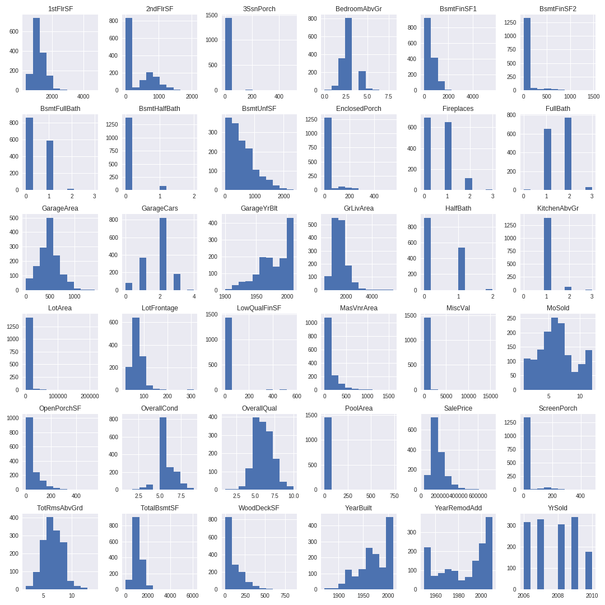
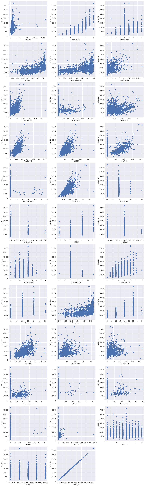
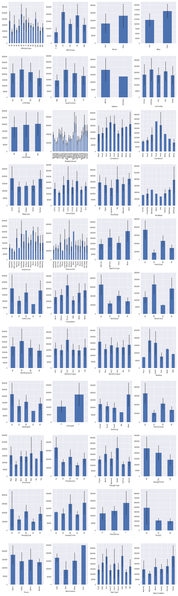

# Predicting House Prices with Advanced Regression Techniques

## The Task
The goal of this project was to use EDA, visualization, data cleaning, preprocessing, and linear models to predict home prices given the features of the home, and interpret your linear models to find out what features add value to a home.  The data was originall taken from Kaggle. 

From Kaggle: 
> Ask a home buyer to describe their dream house, and they probably won't begin with the height of the basement ceiling or the proximity to an east-west railroad. But this playground competition's dataset proves that much more influences price negotiations than the number of bedrooms or a white-picket fence.

> With 79 explanatory variables describing (almost) every aspect of residential homes in Ames, Iowa, this competition challenges you to predict the final price of each home.

## Background
The Ames Housing dataset was compiled by Dean De Cock for use in data science education. It's an incredible alternative for data scientists looking for a modernized and expanded version of the often cited Boston Housing dataset. 

## Exploratory Data Analysis (EDA)
As with any dataset exercise, we began with some EDA.  

### Numeric Variables
There are 36 relevant numerical features.  `MSSubClass`, which "identifies the type of dwelling involved in the sale", is encoded as numeric but is in reality a categorical variable. 

There are 36 numerical features, of the following types:
* Square footage: Indicates the square footage of certain features, i.e. `1stFlrSF` (First floor square footage) and `GarageArea` (Size of garage in square feet).
* Time: Time related variables like when the home was built or sold. 
* Room and amenties: data that represent amenties like "How many bathrooms?"
* Condition and quality: Subjective variables rated from 1-10. 

Most of the variables that deal with the actual physical space of the apartment are postively skewed - which makes sense, as people tend to live in smaller homes/apartments apart from the extremely wealthy. 

Sale Price also has a similar postively skewed distribution - I hypothesize that the variables dealing with the acutal dimensions of the apartment have a large impact on Sale Price. 

Many features do not have a strong relationship with Sale Price, such as 'Year Sold'.  However, a few variables, like overall quality and lot square footage are highly correlated with Sale Price. 

### Categorical Variables 
Similar to the numeric features, there is a range of categorical features. While many look like the sale price varies with category, there are many that don't. Let's identify a few features that affect value. Some include the presence or absence of central air, the neighborhood, the external quality, and the zoning.

There are also features that don't vary in price a lot among different categories, including the roof style and land slope.

## Process 
With a better sense of the data, we're now able to go through and do some analysis on the data.  The process is as follows:

### Pre-processing
In order to run our models on the data, I had to transform many of the variables.  The following pre-processing steps were taken:
* Removing outliers: the classic Tukey method of taking 1.5 * IQR to remove outliers removed too much data.  I therefore removed values that were outside of 3 * IQR instead. 
* Filling NaN values: Many of the variables had NaN values that needed to be dealt with.  Those values were filled accordingly based off of what made the most sense.  For example, NaN values for values like `Alley` were filled with a string ("No Alley"), whereas NaN values for `GarageYrBuilt` were filled with the median to prevent from skewing the data. 
* Created dummy variables for the categorical variables.
* Split the data into a training set and a test set
* Scaled the data 

### Models
Time to build some models!  We began by creating some benchmarks using a Linear Regression model on both the scaled and non-scaled data. We then prepared a series of fits using three regularized linear regression models.  The models we fit were:
- A naive Ridge Regression against the raw data
- A naive Lasso Regression against the raw data
- A naive ElasticNet Regression against the raw data
- A naive Ridge Regression against the scaled data
- A naive Lasso Regression against the scaled data
- A naive ElasticNet Regression against the scaled data

We then imported the Cross-Validation Models for each of the Regularized Linear Models.  

## Results and Conclusions

Our top performing models were: 

| dataset | model        | name        | preprocessing | score              |
|---------|--------------|-------------|---------------|--------------------|
| test    | **LassoCV**      | lasso       | scaled        | 0.8708811803709471 |
| test    | **ElasticNetCV** | elastic net | scaled        | 0.8552059992855636 |
| test    | **RidgeCV**      | ridge       | scaled        | 0.8325365372218565 |

## Conclusions
Roofing a home with clay tile removes the most value. Interestingly, bening next to a park or other outdoor feature also reduces the value of the home. Alterenately, there are a few neighborhoods that increase the value. The most valuable feature in this case is `GrLivArea`. 

Regularized models perform well on this dataset.  A note on the bias/variance tradeoff: According to the Gauss-Markov theorem, the model fit by the Ordinary Least Squares is the least biased estimator of all possible estimators. In other words, it fits the data it has seen better than all possible models. 

It does not necessarily perform well, however, against data that it has not seen. A regularized model penalizes model complexity by limiting the size of the betas. The effect of this is that the model introduces more bias than the OLS model, but becomes more statistically stable and invariant. In other words, it prevents us from overfitting and is better able to generalize to new data. 

